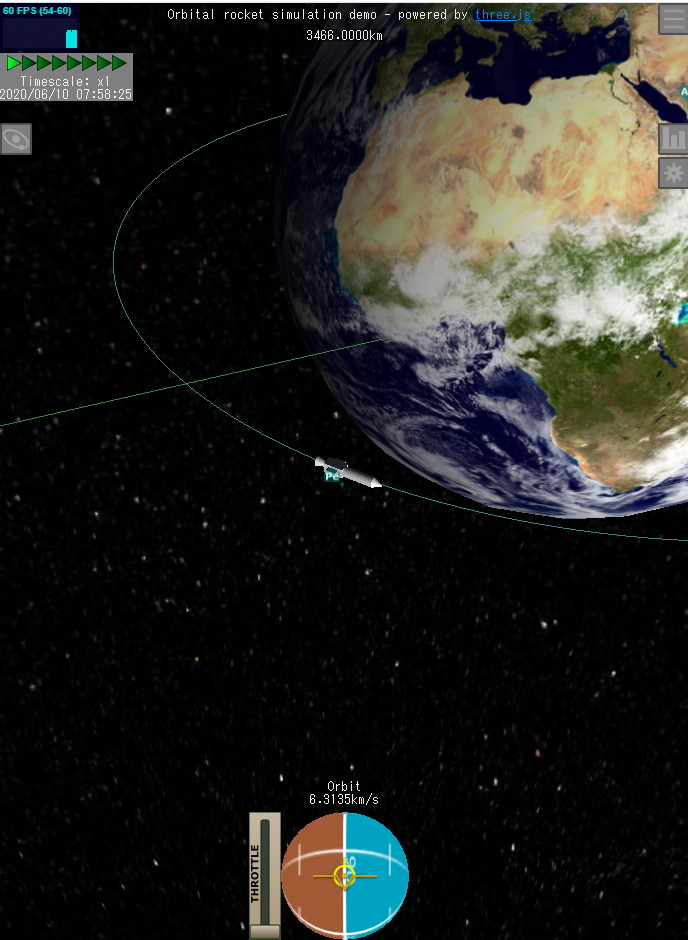
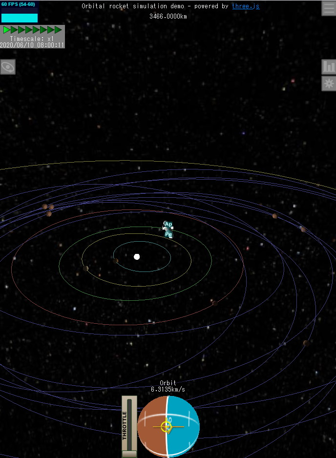

# WebGL-Orbiter

An orbit simulator with Newtonian dynamics which can be manipulated like
amazing game Kerbal Space Program.

Try it now on your browser!

http://msakuta.github.io/WebGL-Orbiter/orbiter.html

## Screenshots

## Sources

* orbiter.html

  The real-time orbital simulator with three.js and WebGL.
  You'll need a WebGL supporting browser in order to enable this simulation.

* runge-kutta.html  

  Formulation of methods used for simulation steps.  Euler method and Runge-Kutta method
  are presented.  You'll need a decent browser with JavaScript support to see the formula.

## Libraries

This project uses three.js JavaScript library for rendering.
